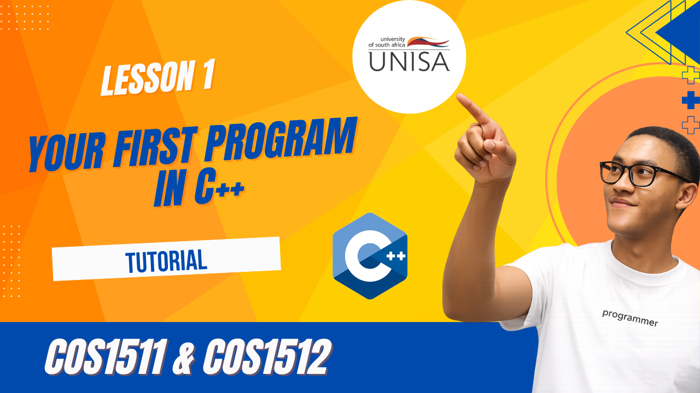

# COS1511 – Introduction to Programming 1 (UNISA) – C++ Tutorial Series

<!-- Replace 'thumbnail.png' with your actual filename once uploaded. 
     If hosted elsewhere, use full URL: https://i.imgur.com/XXXXX.png or similar -->

Welcome to my complete video tutorial series for **COS1511** (Introduction to Programming Using C++) at UNISA!

This repository contains all the code examples, practice files, and notes from the YouTube playlist. Each lesson follows the official UNISA study guide and tutorial letters, explained step-by-step in beginner-friendly videos.

Perfect for:
- Current COS1511 students preparing for assignments, quizzes, and exams
- Anyone starting C++ from scratch
- Self-learners wanting clear, structured explanations

## Playlist Link
Watch the full series here:  
[▶️ COS1511 C++ Tutorials – YouTube Playlist](https://www.youtube.com/playlist?list=PLpfMFZWk8yIDTm4t0g0NgmTSLw1UYWA_9)  

---

## 📚 Topics Covered (So Far)

- Introduction to C++
- Your First Program
- Variables and Integers
- Assignment Statements
- Floating Point Numbers
- While Loops

More lessons coming soon:

- Functions  
- For-loops  
- Switch statements  
- Arrays  
- File I/O  
- Classes
- And beyond  

Stay subscribed on YouTube for updates.

--